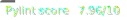
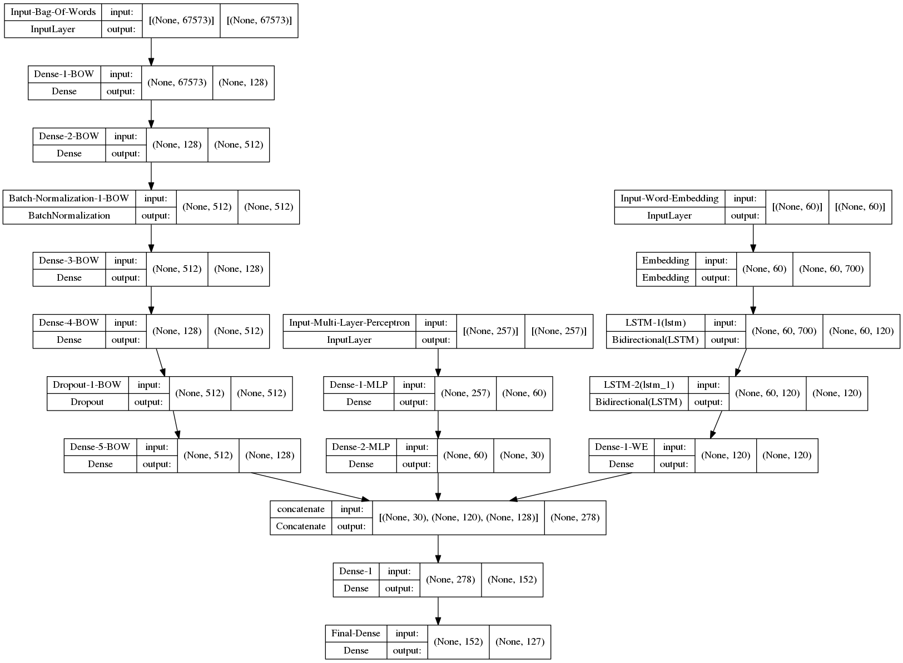

[](https://www.python.org/downloads/release/python-3810/)
[](https://jupyter.org/)
[](https://www.mysql.com/en/)
[](https://www.tensorflow.org/?hl=en)
[](https://pandas.pydata.org/)
[](https://www.nlm.nih.gov/research/umls/index.html)

# UMLS Metathesaurus - Semantic Network Machine Learning

[](https://pylint.pycqa.org/en/latest/)

## :book: Description :

Machine Learning model that learns from Unified Medical Language System Metathesaurus (**UMLS Metathesaurus**) database tagging new graph in Semantic Network

## :rocket: How to use :

0- Complete the **.env** file with the following variables :

```
HOST=<host_of_your_umls_database>
USER=<user_of_your_umls_database>
PASSWORD=<password_of_your_umls_database>
DB=<name_of_your_umls_database>
UMLS_API_KEY=<your_api_key>
```

1- Install the required packages

```bash
$ pip install -r requirements.txt
```

2- Launch pipeline

```bash
$ python main.py
```

*You can use flags to customize the args in the pipeline*

```bash
$ python main.py -h

> usage: main.py [-h] [--verbose] [--only_source ONLY_SOURCE] [--only_preprocess ONLY_PREPROCESS]
               [--only_training ONLY_TRAINING] [--limit LIMIT]

optional arguments:
  -h, --help            show this help message and exit
  --verbose             Active verbose mode.
  --only_source ONLY_SOURCE
                        Pipeline launchs only the generation of the source data.
  --only_preprocess ONLY_PREPROCESS
                        Pipeline launchs only the preprocess of the source data.
  --only_training ONLY_TRAINING
                        Pipeline launchs only the training of the preprocessed data.
  --limit LIMIT         Limit of the source data number generated.
```

3- Use MlFlow UI to visualize data in [**localhost:5000**](http://127.0.0.1:5000/)

```
$ mlflow ui
```

## :zap: UMLS API :

We build our own UMLS API to get the data from UMLS Metathesaurus database. To use it, you need to install the UMLS database locally. You can download the database from [here](https://www.nlm.nih.gov/research/umls/licensedcontent/umlsknowledgesources.html) and install it following [these instructions](https://www.nlm.nih.gov/research/umls/implementation_resources/metamorphosys/help.html). Then, you need to import the `umls_api` python package.

We also use the [UMLS REST API](https://www.nlm.nih.gov/research/umls/licensedcontent/umlsknowledgesources.html) to get the data from UMLS Metathesaurus.

## :floppy_disk: Model used :


